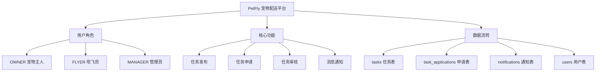
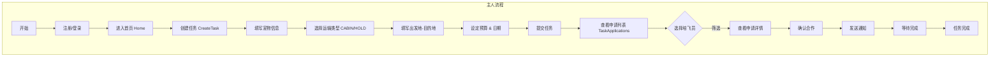
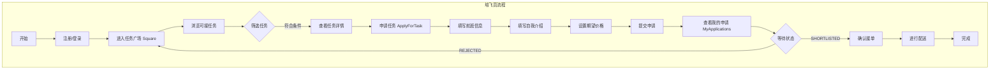
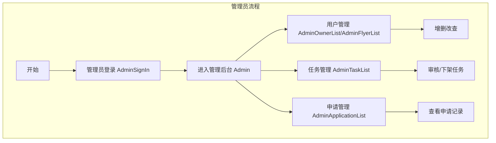
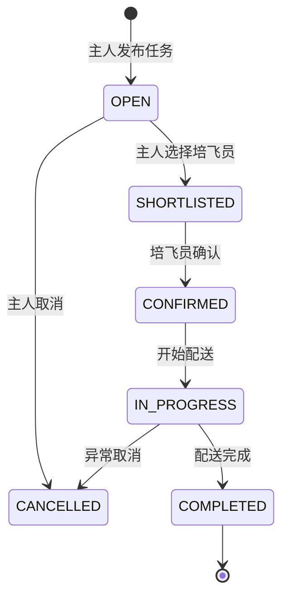
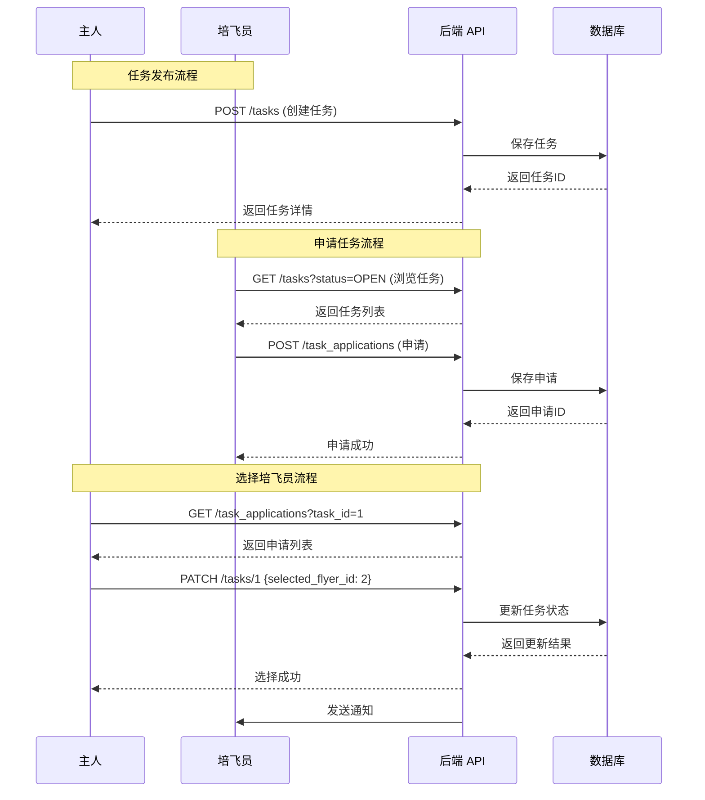
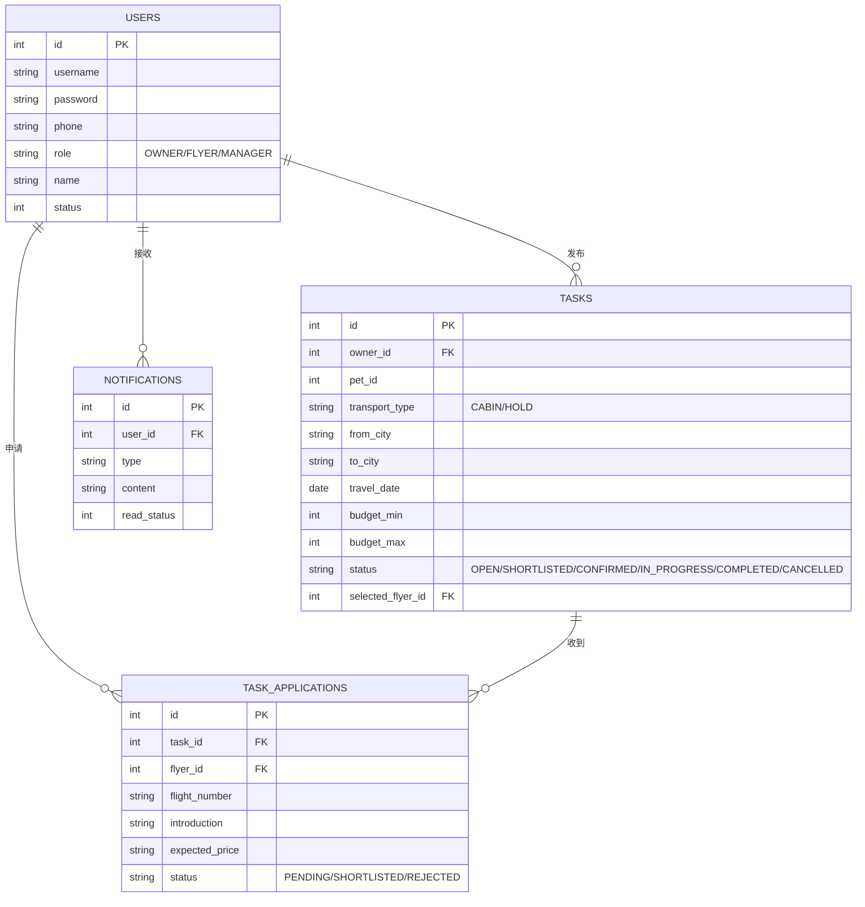

# PetFly 业务流程图

## 1. 整体业务架构图

```mermaid
graph TD
    A[PetFly 宠物配送平台] --> B[用户角色]
    A --> C[核心功能]
    A --> D[数据流转]
    
    B --> B1[OWNER 宠物主人]
    B --> B2[FLYER 培飞员]
    B --> B3[MANAGER 管理员]
    
    C --> C1[任务发布]
    C --> C2[任务申请]
    C --> C3[任务审核]
    C --> C4[消息通知]
    
    D --> D1[tasks 任务表]
    D --> D2[task_applications 申请表]
    D --> D3[notifications 通知表]
    D --> D4[users 用户表]
```

---

## 2. 主人业务流程

```mermaid
flowchart TB
    subgraph 主人流程
    START1["开始"] --> R1[注册/登录]
    R1 --> H1[进入首页 Home]
    H1 --> CT[创建任务 CreateTask]
    CT --> F1[填写宠物信息]
    F1 --> F2[选择运输类型 CABIN/HOLD]
    F2 --> F3[填写出发地-目的地]
    F3 --> F4[设定预算 & 日期]
    F4 --> F5[提交任务]
    F5 --> TA[查看申请列表 TaskApplications]
    TA --> SEL{选择培飞员}
    SEL -->|筛选| AP[查看申请详情]
    AP --> CONF[确认合作]
    CONF --> NOTI[发送通知]
    NOTI --> WAIT[等待完成]
    WAIT --> DONE[任务完成]
    end
```

---

## 3. 培飞员业务流程

```mermaid
flowchart TB
    subgraph 培飞员流程
    START2["开始"] --> R2[注册/登录]
    R2 --> SQ[进入任务广场 Square]
    SQ --> BL[浏览可接任务]
    BL --> FILT{筛选任务}
    FILT -->|符合条件| VIEW[查看任务详情]
    VIEW --> APPLY[申请任务 ApplyForTask]
    APPLY --> F1[填写航班信息]
    F1 --> F2[填写自我介绍]
    F2 --> F3[设置期望价格]
    F3 --> F4[提交申请]
    F4 --> MYA[查看我的申请 MyApplications]
    MYA --> STAT{等待状态}
    STAT -->|SHORTLISTED| CONF[确认接单]
    STAT -->|REJECTED| SQ
    CONF --> PROG[进行配送]
    PROG --> COMPLETE[完成]
    end
```

---

## 4. 管理员业务流程

```mermaid
flowchart TB
    subgraph 管理员流程
    START3["开始"] --> AL[管理员登录 AdminSignIn]
    AL --> AD[进入管理后台 Admin]
    AD --> M1[用户管理 AdminOwnerList/AdminFlyerList]
    AD --> M2[任务管理 AdminTaskList]
    AD --> M3[申请管理 AdminApplicationList]
    M1 --> AC1[增删改查]
    M2 --> AC2[审核/下架任务]
    M3 --> AC3[查看申请记录]
    end
```

---

## 5. 任务状态流转图

```mermaid
stateDiagram-v2
    [*] --> OPEN : 主人发布任务
    OPEN --> SHORTLISTED : 主人选择培飞员
    OPEN --> CANCELLED : 主人取消
    SHORTLISTED --> CONFIRMED : 培飞员确认
    CONFIRMED --> IN_PROGRESS : 开始配送
    IN_PROGRESS --> COMPLETED : 配送完成
    IN_PROGRESS --> CANCELLED : 异常取消
    COMPLETED --> [*]
```

---

## 6. API 交互流程

```mermaid
sequenceDiagram
    participant Owner as 主人
    participant Flyer as 培飞员
    participant API as 后端 API
    participant DB as 数据库

    Note over Owner,Flyer: 任务发布流程
    Owner->>API: POST /tasks (创建任务)
    API->>DB: 保存任务
    DB-->>API: 返回任务ID
    API-->>Owner: 返回任务详情

    Note over Flyer,API: 申请任务流程
    Flyer->>API: GET /tasks?status=OPEN (浏览任务)
    API-->>Flyer: 返回任务列表
    Flyer->>API: POST /task_applications (申请)
    API->>DB: 保存申请
    DB-->>API: 返回申请ID
    API-->>Flyer: 申请成功

    Note over Owner,API: 选择培飞员流程
    Owner->>API: GET /task_applications?task_id=1
    API-->>Owner: 返回申请列表
    Owner->>API: PATCH /tasks/1 {selected_flyer_id: 2}
    API->>DB: 更新任务状态
    DB-->>API: 返回更新结果
    API-->>Owner: 选择成功
    API->>Flyer: 发送通知
```

---

## 7. 数据库 ER 图

```mermaid
erDiagram
    USERS ||--o{ TASKS : "发布"
    USERS ||--o{ TASK_APPLICATIONS : "申请"
    TASKS ||--o{ TASK_APPLICATIONS : "收到"
    USERS ||--o{ NOTIFICATIONS : "接收"

    USERS {
        int id PK
        string username
        string password
        string phone
        string role "OWNER/FLYER/MANAGER"
        string name
        int status
    }

    TASKS {
        int id PK
        int owner_id FK
        int pet_id
        string transport_type "CABIN/HOLD"
        string from_city
        string to_city
        date travel_date
        int budget_min
        int budget_max
        string status "OPEN/SHORTLISTED/CONFIRMED/IN_PROGRESS/COMPLETED/CANCELLED"
        int selected_flyer_id FK
    }

    TASK_APPLICATIONS {
        int id PK
        int task_id FK
        int flyer_id FK
        string flight_number
        string introduction
        string expected_price
        string status "PENDING/SHORTLISTED/REJECTED"
    }

    NOTIFICATIONS {
        int id PK
        int user_id FK
        string type
        string content
        int read_status
    }
```
