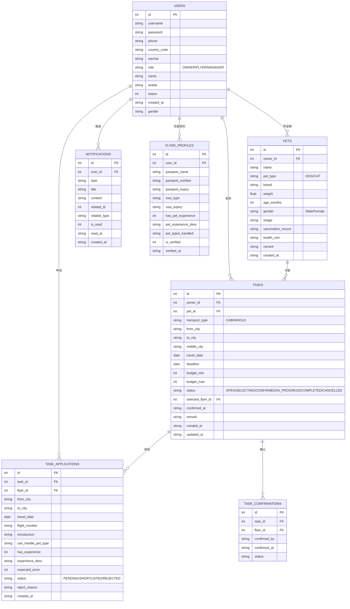
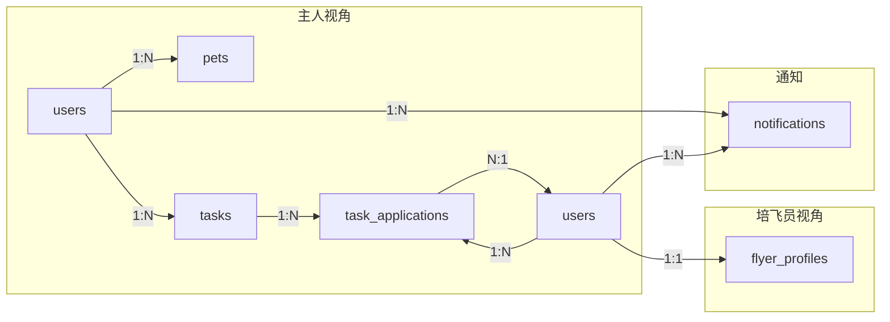

# PetFly 数据库设计文档

## 一、数据库概览

PetFly 项目使用 **JSON Server** (Mock API)，共 **7 张数据表**：

| 表名 | 说明 | 记录数 |
|------|------|--------|
| `users` | 用户表（主人/培飞员/管理员） | 13 |
| `flyer_profiles` | 培飞员详细资料表 | 2 |
| `pets` | 宠物表 | 4 |
| `tasks` | 任务表 | 5 |
| `task_applications` | 申请表 | 6 |
| `notifications` | 通知表 | 3 |
| `task_confirmations` | 任务确认表 | 0 |

---

## 二、ER 关系图



---

## 三、详细表结构

### 3.1 users（用户表）

**说明**：存储所有用户信息，包括主人、培飞员、管理员

| 字段 | 类型 | 说明 | 示例 |
|------|------|------|------|
| `id` | int | 主键，自增 | 1 |
| `username` | string | 用户名（登录用） | "zhangsan" |
| `password` | string | 密码（明文，仅 Mock） | "123456" |
| `phone` | string | 手机号 | "13800138000" |
| `country_code` | string | 国家区号 | "+86" |
| `wechat` | string | 微信号 | "owner001" |
| `role` | string | 角色 | `OWNER` / `FLYER` / `MANAGER` |
| `name` | string | 真实姓名 | "张三" |
| `avatar` | string | 头像URL | null |
| `status` | int | 账号状态（1=正常） | 1 |
| `created_at` | string | 创建时间 | "2026-03-01T10:00:00Z" |
| `gender` | string | 性别 | "Male" / "Female" |

---

### 3.2 flyer_profiles（培飞员资料表）

**说明**：存储培飞员的详细信息（护照、签证、经验等）

| 字段 | 类型 | 说明 | 示例 |
|------|------|------|------|
| `id` | int | 主键 | 1 |
| `user_id` | int | 关联 users.id | 2 |
| `passport_name` | string | 护照姓名 | "李四" |
| `passport_number` | string | 护照号码 | "E12345678" |
| `passport_expiry` | string | 护照有效期 | "2030-12-31" |
| `visa_type` | string | 签证类型 | "Work" |
| `visa_expiry` | string | 签证有效期 | "2027-12-31" |
| `has_pet_experience` | int | 是否有宠物经验 | 1 |
| `pet_experience_desc` | string | 经验描述 | "养狗5年..." |
| `pet_types_handled` | string | 可照顾的宠物类型 | "DOG,CAT" |
| `is_verified` | int | 是否认证通过 | 1 |
| `verified_at` | string | 认证时间 | "2026-03-01T10:00:00Z" |

---

### 3.3 pets（宠物表）

**说明**：存储宠物信息

| 字段 | 类型 | 说明 | 示例 |
|------|------|------|------|
| `id` | int | 主键 | 1 |
| `owner_id` | int | 关联 users.id（主人） | 1 |
| `name` | string | 宠物名字 | "豆豆" |
| `pet_type` | string | 宠物类型 | `DOG` / `CAT` |
| `breed` | string | 品种 | "金毛" |
| `weight` | float | 体重(kg) | 25.5 |
| `age_months` | int | 年龄(月) | 24 |
| `gender` | string | 性别 | "Male" / "Female" |
| `image` | string | 宠物图片URL | null |
| `vaccination_record` | string | 疫苗记录 | "已完成" |
| `health_cert` | string | 健康证明 | "健康" |
| `remark` | string | 备注 | "性格温顺" |
| `created_at` | string | 创建时间 | "2026-03-01T10:00:00Z" |

---

### 3.4 tasks（任务表）

**说明**：存储主人发布的宠物配送任务

| 字段 | 类型 | 说明 | 示例 |
|------|------|------|------|
| `id` | int | 主键 | 1 |
| `owner_id` | int | 关联 users.id（发布者） | 1 |
| `pet_id` | int | 关联 pets.id | 1 |
| `transport_type` | string | 运输类型 | `CABIN`（客舱）/ `HOLD`（货舱） |
| `from_city` | string | 出发城市 | "上海" |
| `to_city` | string | 目的城市 | "北京" |
| `middle_city` | string | 中转城市 | null |
| `travel_date` | date | 出行日期 | "2026-04-01" |
| `deadline` | date | 截止日期 | null |
| `budget_min` | int | 预算下限 | 1500 |
| `budget_max` | int | 预算上限 | 2500 |
| `status` | string | 任务状态 | 见下方状态说明 |
| `selected_flyer_id` | int | 选中的培飞员ID | null |
| `confirmed_at` | string | 确认时间 | null |
| `remark` | string | 备注 | "希望找有经验的培飞员" |
| `created_at` | string | 创建时间 | "2026-03-10T10:00:00Z" |
| `updated_at` | string | 更新时间 | "2026-03-10T10:00:00Z" |

**任务状态说明**：

| 状态 | 说明 |
|------|------|
| `OPEN` | 开放（待申请） |
| `SELECTING` | 选择中（主人筛选培飞员） |
| `CONFIRMED` | 已确认（已选择培飞员） |
| `IN_PROGRESS` | 进行中（配送中） |
| `COMPLETED` | 已完成 |
| `CANCELLED` | 已取消 |

---

### 3.5 task_applications（申请表）

**说明**：培飞员对任务的申请记录

| 字段 | 类型 | 说明 | 示例 |
|------|------|------|------|
| `id` | int | 主键 | 1 |
| `task_id` | int | 关联 tasks.id | 1 |
| `flyer_id` | int | 关联 users.id（申请者） | 2 |
| `from_city` | string | 出发城市 | "上海" |
| `to_city` | string | 目的城市 | "北京" |
| `travel_date` | date | 出行日期 | "2026-04-01" |
| `flight_number` | string | 航班号 | "CA1234" |
| `introduction` | string | 自我介绍 | "修改后的自我介绍" |
| `can_handle_pet_type` | string | 可照顾的宠物类型 | "DOG,CAT" |
| `has_experience` | int | 是否有经验 | 1 |
| `experience_desc` | string | 经验描述 | "养过金毛和英短" |
| `expected_price` | int | 期望价格 | 2000 |
| `status` | string | 申请状态 | 见下方说明 |
| `reject_reason` | string | 拒绝原因 | null |
| `created_at` | string | 创建时间 | "2026-03-10T12:00:00Z" |

**申请状态说明**：

| 状态 | 说明 |
|------|------|
| `PENDING` | 待审核 |
| `SHORTLISTED` | 已入围（被主人选中） |
| `REJECTED` | 已拒绝 |

---

### 3.6 notifications（通知表）

**说明**：用户收到的通知消息

| 字段 | 类型 | 说明 | 示例 |
|------|------|------|------|
| `id` | int | 主键 | 1 |
| `user_id` | int | 关联 users.id（接收者） | 1 |
| `type` | string | 通知类型 | `APPLICATION_NEW` |
| `title` | string | 标题 | "有新申请" |
| `content` | string | 内容 | "培飞员李四申请了您的任务" |
| `related_id` | int | 关联ID | 1 |
| `related_type` | string | 关联类型 | "application" |
| `is_read` | int | 是否已读（0=未读） | 1 |
| `read_at` | string | 阅读时间 | null |
| `created_at` | string | 创建时间 | "2026-03-10T12:00:00Z" |

**通知类型**：

| 类型 | 说明 |
|------|------|
| `APPLICATION_NEW` | 新申请通知 |
| `APPLICATION_ACCEPTED` | 申请被接受 |
| `APPLICATION_REJECTED` | 申请被拒绝 |
| `TASK_CONFIRMED` | 任务已确认 |
| `TASK_COMPLETED` | 任务已完成 |

---

### 3.7 task_confirmations（任务确认表）

**说明**：任务确认记录（当前为空表）

| 字段 | 类型 | 说明 |
|------|------|------|
| `id` | int | 主键 |
| `task_id` | int | 关联 tasks.id |
| `flyer_id` | int | 关联 users.id |
| `confirmed_by` | string | 确认人 |
| `confirmed_at` | string | 确认时间 |
| `status` | string | 状态 |

---

## 四、业务流程与表关系



---

## 五、索引与查询示例

### 常用查询

```javascript
// 获取所有主人
GET /users?role=OWNER

// 获取所有培飞员
GET /users?role=FLYER

// 获取某主人的宠物
GET /pets?owner_id=1

// 获取某主人的任务
GET /tasks?owner_id=1

// 获取某任务的申请列表
GET /task_applications?task_id=1

// 获取某培飞员的申请
GET /task_applications?flyer_id=2

// 获取某用户未读通知
GET /notifications?user_id=1&is_read=0

// 获取开放的任务
GET /tasks?status=OPEN
```

---

*文档生成时间: 2026-03-15*
